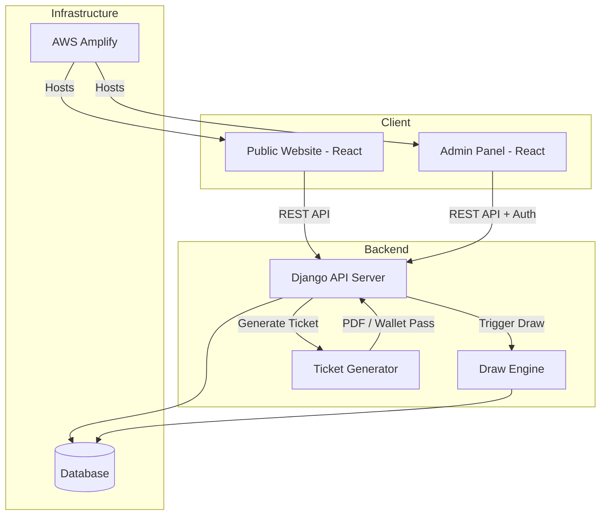
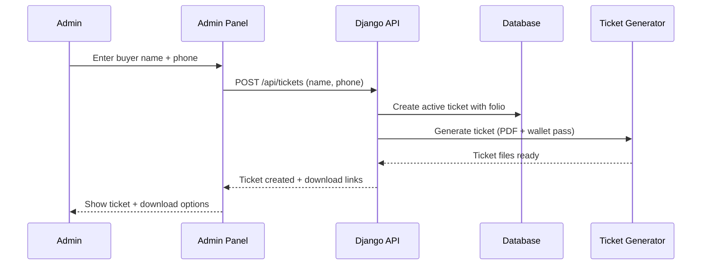
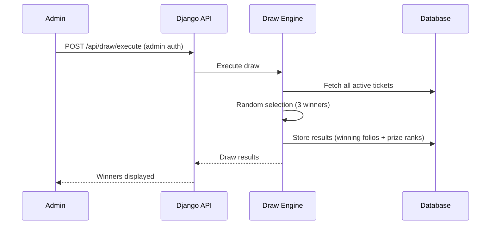
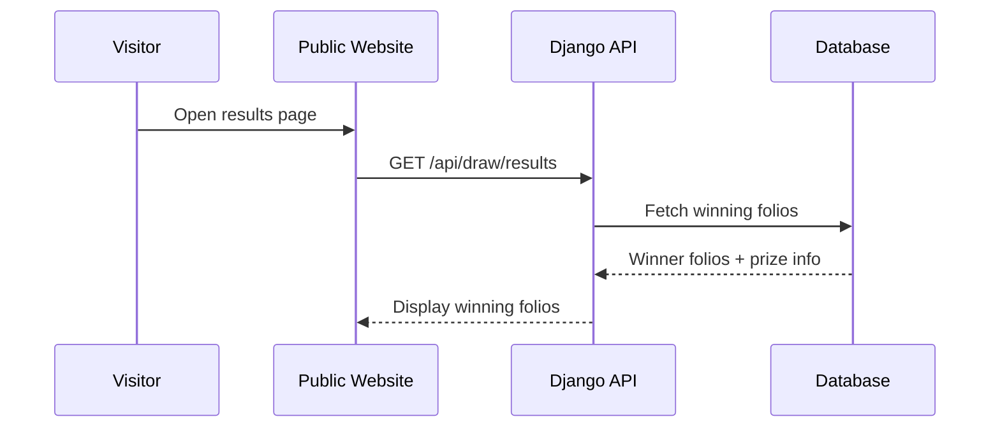
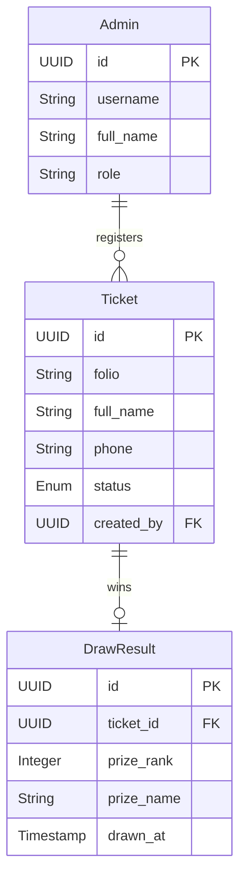

# Design Document: Gift Draw Platform (Simplified v2)

## Overview

The HyperCore Gift Draw Platform is a single-use web application for a fundraising raffle. Team HyperCore (Universidad Tecmilenio) needs to fund their trip to the KIA Mexico Innovation MeetUp 2026 finals in Cancún. The platform lets the team register ticket buyers, run a randomized draw, and publish results — all through a simple public website and an admin panel.

Key simplifications from v1:
- No payment processing in the system (all offline — cash/transfers)
- No email notifications (winners contacted personally via WhatsApp)
- No public self-registration (team registers buyers via admin panel)
- No user accounts or login for buyers
- Registration data: name + phone number only

## Architecture

### Request Flow: Ticket Registration (Admin)

### Request Flow: Draw Execution

### Request Flow: Public Results Query

## Components and Interfaces

### Component 1: Public Website (React)

**Purpose**: Read-only site for visitors. No registration, no login, no accounts.

**Pages**:

| Page | Route | Description |
| ---- | ----- | ----------- |
| Home / Flyer | `/` | Landing page: draw info, prizes, fundraising dashboard (progress + helpers count), WhatsApp contact (wa.me link), how to participate |
| About Us | `/about` | Team HyperCore intro, member profiles with roles, LinkedIn links, Innovation MeetUp certificates, KIA challenge description |
| Results | `/results` | Winning ticket folio numbers (public, shown after draw executes) |
| Privacy Notice | `/privacy` | Simple data usage notice |

### Component 2: Admin Panel (React, authenticated)

**Purpose**: Team-only interface for managing tickets and running the draw.

**Functions**:
- Register new ticket (name + phone → instant active ticket)
- View all tickets (active, cancelled)
- Cancel a ticket (frees folio for reassignment)
- Reassign a cancelled folio to a new buyer
- Execute the draw (random selection from active tickets)
- View draw results
- View fundraising dashboard stats

**Authentication**: Admin login required (team members only)

### Component 3: Django API Server

**Purpose**: Backend handling all business logic.

**REST API Surface**:

| Method | Endpoint | Description | Auth |
| ------ | -------- | ----------- | ---- |
| POST | `/api/tickets` | Register a new ticket (name, phone) | Admin |
| GET | `/api/tickets` | List all tickets | Admin |
| GET | `/api/tickets/:id` | Get ticket details | Admin |
| PATCH | `/api/tickets/:id/cancel` | Cancel a ticket | Admin |
| POST | `/api/tickets/:id/reassign` | Reassign cancelled folio to new buyer | Admin |
| GET | `/api/tickets/:id/download/pdf` | Download ticket as PDF | Admin |
| GET | `/api/tickets/:id/download/wallet` | Download wallet pass (.pkpass / Google Wallet) | Admin |
| POST | `/api/draw/execute` | Execute the draw | Admin |
| GET | `/api/draw/results` | Get winning folios (public after draw) | Public |
| GET | `/api/dashboard` | Fundraising progress + participant count | Public |
| POST | `/api/auth/login` | Admin login | Public |

### Component 4: Draw Engine

**Purpose**: Isolated randomized winner selection. Selects 3 winners from active tickets.

**Rules**:
- Only active tickets participate (cancelled tickets excluded)
- Each active ticket has equal probability
- Selects exactly 3 winners (1st, 2nd, 3rd place)
- Draw can be re-run with admin confirmation (typing "rewrite draw") — previous results are overwritten

### Component 5: Ticket Generator

**Purpose**: Generates downloadable ticket files in multiple formats.

**Formats**:
- **PDF**: printable ticket with folio, buyer name, draw info
- **Apple Wallet**: .pkpass file for iOS Wallet
- **Google Wallet**: Google Wallet pass link/file

**Ticket content**: folio number, buyer name, draw title, draw date, HyperCore branding

## Data Models

### Ticket

| Field | Type | Description |
| ----- | ---- | ----------- |
| id | UUID | Unique identifier |
| folio | String | Human-readable folio (e.g., "HC-001") — unique, reusable on cancellation |
| full_name | String | Buyer's preferred full name |
| phone | String | Buyer's phone number |
| status | Enum | `active`, `cancelled` |
| created_at | Timestamp | When the ticket was registered |
| cancelled_at | Timestamp | When cancelled (nullable) |
| created_by | FK(Admin) | Which admin registered this ticket |

**Validation Rules**:
- `full_name` required, max 200 characters
- `phone` required, valid format
- `folio` auto-generated, unique, reusable after cancellation
- Only `active` tickets participate in the draw

### DrawResult

| Field | Type | Description |
| ----- | ---- | ----------- |
| id | UUID | Unique identifier |
| ticket_id | UUID | FK to winning ticket |
| prize_rank | Integer | 1, 2, or 3 |
| prize_name | String | Prize description |
| drawn_at | Timestamp | When the draw was executed |

**Validation Rules**:
- Exactly 3 results per draw execution
- `prize_rank` must be 1, 2, or 3
- Results are immutable once created
- Draw can only execute once

### Admin (User)

| Field | Type | Description |
| ----- | ---- | ----------- |
| id | UUID | Unique identifier |
| username | String | Login username |
| password_hash | String | Hashed password |
| full_name | String | Admin's display name |
| role | String | Team role (e.g., "Mechatronics Engineer", "Developer") |

### Flyer / About Us Content

No database table needed — all flyer content (headline, prizes, about us, team profiles, contact info) is **static in the React frontend**. The only dynamic data on the home page is the fundraising dashboard, which is computed from the ticket count via `/api/dashboard`.

### Entity Relationship Diagram

## Error Handling

### Error Scenario 1: Draw with No Active Tickets

**Condition**: Admin tries to execute draw but no tickets have `active` status.
**Response**: API returns validation error. Draw does not execute.

### Error Scenario 2: Draw Already Executed

**Condition**: Admin tries to execute draw again after it already ran.
**Response**: API requires the admin to type "rewrite draw" as confirmation. If confirmed, previous results are deleted and a new draw executes. If not confirmed, existing results are preserved.

### Error Scenario 3: Cancel Already Cancelled Ticket

**Condition**: Admin tries to cancel a ticket that's already cancelled.
**Response**: API returns validation error. No state change.

### Error Scenario 4: Reassign Active Ticket Folio

**Condition**: Admin tries to reassign a folio that's still active.
**Response**: API returns validation error. Only cancelled folios can be reassigned.

## Testing Strategy

### Unit Testing

- Draw Engine: random selection logic, edge cases (3 tickets exactly, 1 ticket, 200 tickets)
- Ticket lifecycle: create, cancel, reassign
- Folio generation and reuse logic
- Admin authentication

### Property-Based Testing

- Draw fairness: over many executions, each active ticket selected with approximately equal frequency
- Folio uniqueness: no two active tickets share the same folio at any point
- Status transitions: only valid transitions allowed (`active` → `cancelled`)

### Integration Testing

- Full flow: register ticket → cancel → reassign → execute draw → view results
- Ticket download: PDF generation, wallet pass generation
- Admin auth flow: login → perform actions → unauthorized access blocked
- Public results page: shows correct winning folios after draw

## Security Considerations

- Admin endpoints require authentication (Django session or JWT)
- Public endpoints are read-only (results, dashboard)
- No PII exposed on public pages (results show folio numbers only, not names)
- HTTPS enforced (AWS Certificate Manager)
- Input validation on all fields
- Rate limiting on public endpoints
- Simple privacy notice: data used only for the draw, deleted after event, not shared/sold

## Tech Stack

| Component | Technology |
| --------- | ---------- |
| Backend | Django (Python) |
| Frontend | React |
| Database | PostgreSQL (or SQLite for MVP) |
| Hosting | AWS Amplify |
| SSL/Domain | AWS Certificate Manager |
| Ticket PDF | Python PDF library (reportlab or weasyprint) |
| Wallet Passes | Apple: .pkpass generation / Google: Google Wallet API |

## Performance Considerations

- 200 tickets max — performance is not a concern at this scale
- Draw execution is instant for this ticket count
- Results page is cacheable (immutable after draw)
- Dashboard can be computed on-the-fly (count active tickets × $200)

## Correctness Properties

*A property is a characteristic or behavior that should hold true across all valid executions of a system — essentially, a formal statement about what the system should do. Properties serve as the bridge between human-readable specifications and machine-verifiable correctness guarantees.*

### Property 1: Folio uniqueness invariant

*For any* sequence of ticket creation, cancellation, and reassignment operations, no two Active_Tickets shall share the same Folio at any point in time.

**Validates: Requirements 1.4, 3.3, 12.3**

### Property 2: Invalid input rejection

*For any* buyer name that is empty or exceeds 200 characters, or *for any* phone number that is empty or in an invalid format, submitting a ticket creation request shall be rejected with a validation error and no ticket shall be created.

**Validates: Requirements 1.2, 1.3**

### Property 3: Ticket state machine

*For any* ticket, the only valid status transition is from `active` to `cancelled`. Attempting to cancel an already-cancelled ticket or reactivate a cancelled ticket shall be rejected, leaving the ticket unchanged.

**Validates: Requirements 2.1, 2.2, 12.1, 12.2**

### Property 4: Cancelled tickets excluded from draw

*For any* set of tickets containing both active and cancelled tickets, executing the draw shall only select winners from Active_Tickets. No Cancelled_Ticket shall ever appear in the Draw_Results.

**Validates: Requirements 2.3, 6.1**

### Property 5: Draw produces exactly 3 distinct winners

*For any* set of 3 or more Active_Tickets, executing the draw shall produce exactly 3 Draw_Results with prize ranks 1, 2, and 3, each referencing a distinct ticket.

**Validates: Requirements 6.1, 6.6**

### Property 6: Draw fairness

*For any* set of Active_Tickets, over a large number of independent draw executions on the same set, each Active_Ticket shall be selected as a winner with approximately equal frequency (uniform distribution).

**Validates: Requirement 6.2**

### Property 7: Draw immutability

*For any* completed draw, the stored Draw_Results shall not change on subsequent requests. Attempting to execute the draw a second time shall return a conflict error and the original results shall remain identical.

**Validates: Requirements 6.3, 6.4**

### Property 8: Folio reassignment on cancelled tickets

*For any* cancelled Folio and valid buyer data, reassigning the folio shall produce a new Active_Ticket reusing that Folio. *For any* Folio belonging to an Active_Ticket, attempting reassignment shall be rejected.

**Validates: Requirements 3.1, 3.2**

### Property 9: No PII in public results

*For any* draw result returned by the public results endpoint, the response shall contain only Folio numbers and prize ranks. No buyer name or phone number shall be present in the response.

**Validates: Requirements 7.1, 11.4**

### Property 10: Dashboard computation

*For any* set of tickets with varying statuses, the dashboard endpoint shall return a count equal to the number of Active_Tickets and a total amount equal to that count multiplied by $200 MXN.

**Validates: Requirement 8.1**

### Property 11: Admin endpoint authentication enforcement

*For any* admin-only endpoint (ticket management, draw execution), sending a request without valid authentication shall return an unauthorized error. *For any* public endpoint (results, dashboard, login), sending a request without authentication shall succeed.

**Validates: Requirements 10.2, 10.3, 10.4**

### Property 12: Ticket generation content completeness

*For any* ticket, generating a downloadable file (PDF, Apple Wallet, or Google Wallet) shall produce output containing the folio number, buyer name, draw title, draw date, and HyperCore branding.

**Validates: Requirements 5.1, 5.2, 5.3**

### Property 13: Ticket list completeness

*For any* set of created tickets (active and cancelled), the ticket list endpoint shall return all of them. *For any* individual ticket, the detail endpoint shall return all fields: folio, buyer name, phone, status, creation timestamp, cancellation timestamp, and creating admin.

**Validates: Requirements 4.1, 4.2**

### Property 14: Password storage security

*For any* Admin record in the database, the stored password value shall be a hash, never the plain-text password.

**Validates: Requirement 11.5**

## Dependencies

| Dependency | Purpose |
| ---------- | ------- |
| Django + DRF | API server, auth, ORM |
| React | Frontend SPA |
| PostgreSQL or SQLite | Database |
| reportlab or weasyprint | PDF ticket generation |
| passbook / wallet library | Apple Wallet .pkpass generation |
| Google Wallet API | Google Wallet pass generation |
| AWS Amplify | Hosting + CI/CD |
| AWS Certificate Manager | SSL certificates |
