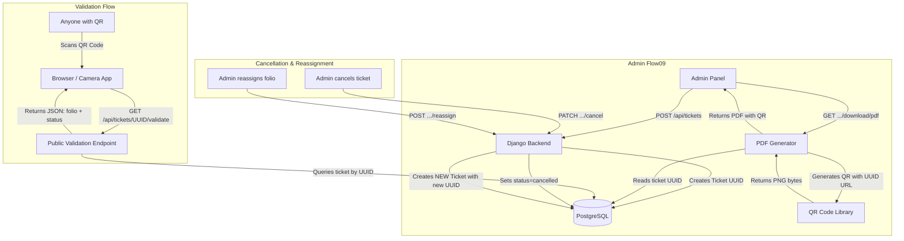
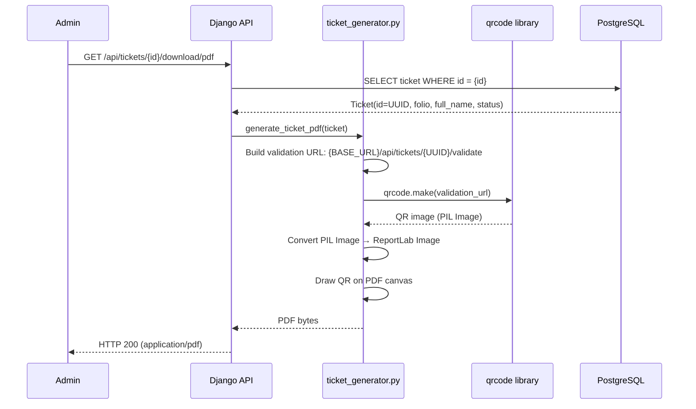
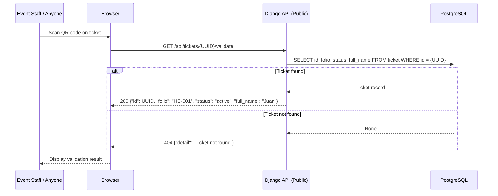
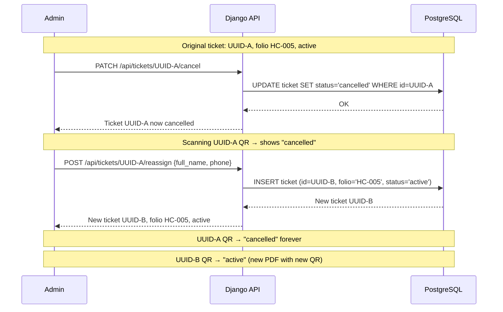

# Design Document: QR Ticket Validation

## Overview

The QR Ticket Validation feature adds a QR code to every generated PDF ticket that encodes a public validation URL containing the ticket's UUID. When scanned, the URL hits a public (no-auth) API endpoint that returns the ticket's current status — active or cancelled ("cancelado"). This solves the core problem: once a physical/PDF ticket is printed, there is currently no way for event staff or the ticket holder to verify whether the ticket is still valid, especially after cancellations and folo reassignments.

The design leverages the existing UUID primary key on the `Ticket` model. Each ticket (including reassigned ones) already has a unique UUID, so cancelled tickets and their replacement tickets naturally have distinct QR codes. Scanning a cancelled ticket's QR always returns "cancelled" regardless of whether the folio was reassigned. The new ticket created on reassignment gets its own UUID and its own QR code.

The feature touches three layers: (1) a new public validation endpoint, (2) QR code generation using the `qrcode` Python library, and (3) embedding the QR image into the existing reportlab PDF generator.

## **Architecture**



## Sequence Diagrams

### QR Code Generation (PDF Download)



### QR Scan Validation



### Cancel + Reassign Flow (Two QR Codes)




## Components and Interfaces

### Component 1: Public Validation Endpoint

**Purpose**: Allows anyone who scans a QR code to check if a ticket is valid. No authentication required.

**Interface**:
```python
# GET /api/tickets/<uuid:ticket_id>/validate
# Permission: AllowAny (public)
# Throttle: PublicEndpointThrottle (30/minute)

class TicketValidateView(APIView):
    permission_classes = [AllowAny]
    throttle_classes = [PublicEndpointThrottle]

    def get(self, request, ticket_id: uuid.UUID) -> Response:
        """Return ticket validation status."""
        ...
```

**Response Schema**:
```python
# 200 OK — Ticket found
{
    "id": "550e8400-e29b-41d4-a716-446655440000",
    "folio": "HC-005",
    "status": "active",       # or "cancelled"
    "full_name": "Juan Pérez"
}

# 404 Not Found — Invalid UUID
{
    "detail": "Ticket not found."
}
```

**Responsibilities**:
- Look up ticket by UUID primary key
- Return folio, status, full_name, and ticket id
- Rate-limit to prevent abuse (reuses existing `PublicEndpointThrottle`)
- No authentication required — anyone with the URL can validate

### Component 2: QR Code Generator Utility

**Purpose**: Generates a QR code image (as bytes) encoding the validation URL for a given ticket.

**Interface**:
```python
# backend/core/qr_utils.py

def generate_qr_image(ticket_id: uuid.UUID, base_url: str) -> bytes:
    """Generate a QR code PNG encoding the validation URL.

    Args:
        ticket_id: The ticket's UUID.
        base_url: The base URL of the application (e.g., "https://api.hypercoreqro.lat").

    Returns:
        PNG image bytes of the QR code.
    """
    ...
```

**Responsibilities**:
- Build the validation URL: `{base_url}/api/tickets/{ticket_id}/validate`
- Generate QR code using the `qrcode` library with appropriate error correction
- Return PNG bytes suitable for embedding in reportlab PDFs
- Keep QR size reasonable for A6 ticket layout (~25mm × 25mm)

### Component 3: Updated PDF Generator

**Purpose**: Modify the existing `generate_ticket_pdf()` to embed a QR code on the ticket.

**Interface**:
```python
# backend/core/ticket_generator.py (modified)

def generate_ticket_pdf(ticket, base_url: str = "") -> bytes:
    """Generate a PDF ticket with embedded QR code.

    Args:
        ticket: Ticket model instance.
        base_url: Base URL for building the QR validation link.
                  If empty, uses SITE_BASE_URL from Django settings.

    Returns:
        PDF content as bytes.
    """
    ...
```

**Responsibilities**:
- Call `generate_qr_image()` to get QR PNG bytes
- Embed QR image on the PDF using reportlab's `ImageReader`
- Position QR code in the lower-right area of the ticket, above the footer
- Maintain existing design system (PRIMARY #00534C, ACCENT #DCFF52)

### Component 4: Validation Response Serializer

**Purpose**: Serializes the minimal ticket data needed for QR validation responses.

**Interface**:
```python
# backend/core/serializers.py (new serializer)

class TicketValidationSerializer(serializers.ModelSerializer):
    class Meta:
        model = Ticket
        fields = ['id', 'folio', 'status', 'full_name']
```

**Responsibilities**:
- Expose only the fields needed for validation (no phone, no created_by)
- Minimal data exposure for the public endpoint

## Data Models

No new models are required. The existing `Ticket` model already has everything needed:

```python
class Ticket(models.Model):
    id = models.UUIDField(primary_key=True, default=uuid.uuid4, editable=False)
    folio = models.CharField(max_length=20, db_index=True)
    full_name = models.CharField(max_length=200)
    phone = models.CharField(max_length=20)
    status = models.CharField(max_length=10, choices=Status.choices, default=Status.ACTIVE)
    created_at = models.DateTimeField(auto_now_add=True)
    cancelled_at = models.DateTimeField(null=True, blank=True)
    created_by = models.ForeignKey(...)
```

**Key property**: Each ticket row has a unique UUID (`id`). When a folio is reassigned, a new `Ticket` row is created with a new UUID. The cancelled ticket's UUID remains in the database with `status='cancelled'`. This means:
- Old QR (UUID-A) → always resolves to "cancelled"
- New QR (UUID-B) → resolves to "active"

**Validation Rules**:
- `ticket_id` in the URL must be a valid UUID format (enforced by Django's `<uuid:ticket_id>` URL converter)
- Ticket must exist in the database (404 if not found)

### Configuration Addition

```python
# backend/config/settings.py — new setting
SITE_BASE_URL = os.getenv('SITE_BASE_URL', 'http://localhost:8000')
```

This setting provides the base URL used to construct QR validation links. In production, this would be the public API domain (e.g., `https://api.hypercoreqro.lat`).


## Key Functions with Formal Specifications

### Function 1: `generate_qr_image()`

```python
def generate_qr_image(ticket_id: uuid.UUID, base_url: str) -> bytes:
    """Generate QR code PNG bytes for a ticket validation URL."""
```

**Preconditions:**
- `ticket_id` is a valid UUID (non-null)
- `base_url` is a non-empty string representing a valid URL scheme + host (e.g., `https://api.hypercoreqro.lat`)
- `base_url` does not end with a trailing slash

**Postconditions:**
- Returns non-empty `bytes` representing a valid PNG image
- The QR code, when decoded, yields exactly the string `{base_url}/api/tickets/{ticket_id}/validate`
- The PNG image dimensions are suitable for embedding at ~25mm on an A6 PDF
- No side effects (pure function)

**Loop Invariants:** N/A

### Function 2: `TicketValidateView.get()`

```python
def get(self, request, ticket_id: uuid.UUID) -> Response:
    """Public endpoint: validate a ticket by UUID."""
```

**Preconditions:**
- `ticket_id` is a valid UUID (enforced by Django URL routing `<uuid:ticket_id>`)
- Request is an HTTP GET
- No authentication required

**Postconditions:**
- If ticket with `id == ticket_id` exists: returns HTTP 200 with `{id, folio, status, full_name}`
- If ticket does not exist: returns HTTP 404 with `{"detail": "Ticket not found."}`
- Response `status` field is always either `"active"` or `"cancelled"` (matches `Ticket.Status` choices)
- No mutations to any data

**Loop Invariants:** N/A

### Function 3: `generate_ticket_pdf()` (modified)

```python
def generate_ticket_pdf(ticket, base_url: str = "") -> bytes:
    """Generate PDF ticket with embedded QR code."""
```

**Preconditions:**
- `ticket` is a valid `Ticket` model instance with `id`, `folio`, `full_name`, `phone` populated
- `base_url` is either a non-empty valid URL string or empty (falls back to `settings.SITE_BASE_URL`)

**Postconditions:**
- Returns non-empty `bytes` representing a valid PDF document
- The PDF contains all existing elements (header, folio, participant info, date chip, footer)
- The PDF additionally contains a QR code image that, when scanned, yields the validation URL
- The QR code is positioned in the lower-right area, above the footer, without overlapping existing elements
- If `base_url` is empty, uses `django.conf.settings.SITE_BASE_URL`

**Loop Invariants:** N/A

## Algorithmic Pseudocode

### QR Image Generation Algorithm

```python
import io
import qrcode
from qrcode.constants import ERROR_CORRECT_M

def generate_qr_image(ticket_id: uuid.UUID, base_url: str) -> bytes:
    """
    ALGORITHM generate_qr_image
    INPUT: ticket_id (UUID), base_url (str)
    OUTPUT: png_bytes (bytes)

    Precondition: ticket_id is valid UUID, base_url is non-empty URL
    Postcondition: png_bytes decodes to QR containing validation URL
    """
    # Step 1: Build the validation URL
    validation_url = f"{base_url}/api/tickets/{ticket_id}/validate"

    # Step 2: Create QR code with medium error correction
    # ERROR_CORRECT_M recovers ~15% damage — good balance for printed tickets
    qr = qrcode.QRCode(
        version=None,          # auto-size based on data length
        error_correction=ERROR_CORRECT_M,
        box_size=10,
        border=2,              # minimal quiet zone (standard is 4, but 2 works for embedded use)
    )
    qr.add_data(validation_url)
    qr.make(fit=True)

    # Step 3: Render to PIL Image, then to PNG bytes
    img = qr.make_image(fill_color="black", back_color="white")
    buf = io.BytesIO()
    img.save(buf, format="PNG")
    buf.seek(0)
    return buf.read()
```

### Validation Endpoint Algorithm

```python
from rest_framework.permissions import AllowAny
from rest_framework.views import APIView
from rest_framework.response import Response
from rest_framework import status
from .models import Ticket
from .serializers import TicketValidationSerializer
from .throttles import PublicEndpointThrottle

class TicketValidateView(APIView):
    """
    ALGORITHM validate_ticket
    INPUT: ticket_id (UUID from URL path)
    OUTPUT: JSON response with ticket status

    Precondition: ticket_id is valid UUID format (enforced by URL router)
    Postcondition: returns 200 with ticket data OR 404 if not found
    """
    permission_classes = [AllowAny]
    throttle_classes = [PublicEndpointThrottle]

    def get(self, request, ticket_id):
        # Step 1: Query ticket by UUID
        try:
            ticket = Ticket.objects.get(pk=ticket_id)
        except Ticket.DoesNotExist:
            return Response(
                {"detail": "Ticket not found."},
                status=status.HTTP_404_NOT_FOUND,
            )

        # Step 2: Serialize minimal validation data
        serializer = TicketValidationSerializer(ticket)
        return Response(serializer.data, status=status.HTTP_200_OK)
```

### PDF QR Embedding Algorithm

```python
def generate_ticket_pdf(ticket, base_url: str = "") -> bytes:
    """
    ALGORITHM generate_ticket_pdf (modified)
    INPUT: ticket (Ticket instance), base_url (str, optional)
    OUTPUT: pdf_bytes (bytes)

    Modification: adds QR code to existing PDF layout
    """
    # ... existing PDF generation code (header, folio, participant card, etc.) ...

    # NEW: QR Code Section
    # Step 1: Resolve base URL
    if not base_url:
        from django.conf import settings
        base_url = getattr(settings, 'SITE_BASE_URL', 'http://localhost:8000')

    # Step 2: Generate QR image bytes
    from .qr_utils import generate_qr_image
    qr_bytes = generate_qr_image(ticket.id, base_url)

    # Step 3: Convert to reportlab-compatible image
    from reportlab.lib.utils import ImageReader
    qr_image = ImageReader(io.BytesIO(qr_bytes))

    # Step 4: Draw QR on canvas
    # Position: lower-right area, above footer, below the date chip
    qr_size = 22 * mm  # ~22mm square — fits A6 layout
    qr_x = width - margin - qr_size  # right-aligned
    qr_y = 14 * mm                    # above footer text
    c.drawImage(qr_image, qr_x, qr_y, width=qr_size, height=qr_size)

    # Step 5: Add "ESCANEA PARA VALIDAR" label below QR
    c.setFillColor(ON_SURFACE_MUTED)
    c.setFont("Helvetica", 5)
    c.drawString(qr_x, qr_y - 3 * mm, "ESCANEA PARA VALIDAR")

    # ... existing footer code ...
```

## Example Usage

```python
# Example 1: Generate a PDF with QR code
from core.models import Ticket
from core.ticket_generator import generate_ticket_pdf

ticket = Ticket.objects.get(folio="HC-005", status="active")
pdf_bytes = generate_ticket_pdf(ticket, base_url="https://api.hypercoreqro.lat")
# PDF now contains QR code encoding:
# https://api.hypercoreqro.lat/api/tickets/550e8400-e29b-41d4-a716-446655440000/validate

# Example 2: Validate a ticket via the public API
# curl https://api.hypercoreqro.lat/api/tickets/550e8400-e29b-41d4-a716-446655440000/validate
# Response (active):
# {"id": "550e8400-...", "folio": "HC-005", "status": "active", "full_name": "Juan Pérez"}

# Example 3: After cancellation, same QR returns cancelled
# curl https://api.hypercoreqro.lat/api/tickets/550e8400-e29b-41d4-a716-446655440000/validate
# Response (cancelled):
# {"id": "550e8400-...", "folio": "HC-005", "status": "cancelled", "full_name": "Juan Pérez"}

# Example 4: Reassigned folio — new ticket has different UUID and QR
# Old ticket UUID-A (cancelled) → QR still shows "cancelled"
# New ticket UUID-B (active, same folio HC-005) → new QR shows "active"

# Example 5: Generate QR image standalone
from core.qr_utils import generate_qr_image
import uuid

qr_png = generate_qr_image(
    ticket_id=uuid.UUID("550e8400-e29b-41d4-a716-446655440000"),
    base_url="https://api.hypercoreqro.lat",
)
# qr_png is PNG bytes that decode to:
# https://api.hypercoreqro.lat/api/tickets/550e8400-e29b-41d4-a716-446655440000/validate
```


## Correctness Properties

*A property is a characteristic or behavior that should hold true across all valid executions of a system — essentially, a formal statement about what the system should do. Properties serve as the bridge between human-readable specifications and machine-verifiable correctness guarantees.*

### Property 1: QR URL Round-Trip

*For any* valid ticket UUID and non-empty base URL string, encoding them into a QR code via `generate_qr_image()` and then decoding the resulting PNG should yield exactly the string `{base_url}/api/tickets/{ticket_id}/validate` — no extra characters, no truncation.

**Validates: Requirements 1.1, 1.2, 1.3**

### Property 2: Validation Response Contains Exactly the Required Fields

*For any* ticket that exists in the database, a GET request to `/api/tickets/{uuid}/validate` should return HTTP 200 with a response body containing exactly `id`, `folio`, `status`, and `full_name` — and never `phone`, `created_by`, `created_at`, or `cancelled_at`.

**Validates: Requirements 2.1, 2.4**

### Property 3: Non-Existent UUID Returns 404

*For any* randomly generated UUID that does not correspond to a ticket in the database, a GET request to `/api/tickets/{uuid}/validate` should return HTTP 404.

**Validates: Requirements 2.2**

### Property 4: Cancelled Ticket Permanence

*For any* ticket whose status is `cancelled`, the validation endpoint should always return `"status": "cancelled"` for that ticket's UUID, regardless of whether the folio has been reassigned to a new ticket.

**Validates: Requirements 4.1, 4.3**

### Property 5: Reassignment UUID Uniqueness

*For any* cancelled ticket that is reassigned, the newly created ticket should have a UUID that is different from the original cancelled ticket's UUID, while sharing the same folio value.

**Validates: Requirements 4.2**

### Property 6: PDF Generation Embeds QR

*For any* ticket instance, calling `generate_ticket_pdf()` should return non-empty bytes, and the function should invoke `generate_qr_image()` with the ticket's UUID and the resolved base URL.

**Validates: Requirements 3.1, 3.2, 3.6**

## Error Handling

### Error Scenario 1: Invalid UUID Format in URL

**Condition**: Someone manually types or modifies the URL with a non-UUID string (e.g., `/api/tickets/not-a-uuid/validate`)
**Response**: Django's `<uuid:ticket_id>` URL converter rejects the request before it reaches the view. Returns HTTP 404 (Django's default URL-not-matched response).
**Recovery**: No recovery needed — this is expected behavior for malformed URLs.

### Error Scenario 2: Valid UUID but Ticket Not Found

**Condition**: A valid UUID format is provided but no ticket exists with that ID (e.g., ticket was hard-deleted from DB, or UUID was fabricated).
**Response**: HTTP 404 with `{"detail": "Ticket not found."}`.
**Recovery**: No recovery. The QR code is invalid or the ticket data was removed.

### Error Scenario 3: Rate Limiting

**Condition**: A client exceeds 30 requests/minute to the validation endpoint.
**Response**: HTTP 429 Too Many Requests (handled by `PublicEndpointThrottle`).
**Recovery**: Client waits and retries. This prevents brute-force UUID enumeration.

### Error Scenario 4: QR Generation Fails (Missing `qrcode` Library)

**Condition**: The `qrcode` Python package is not installed in the deployment environment.
**Response**: `ImportError` when attempting to generate a PDF. The PDF download endpoint returns HTTP 500.
**Recovery**: Install the dependency: `pip install qrcode[pil]`. Add to `requirements.txt`.

### Error Scenario 5: Empty or Missing `SITE_BASE_URL`

**Condition**: The `SITE_BASE_URL` setting is not configured and no `base_url` is passed to the PDF generator.
**Response**: Falls back to `http://localhost:8000`. QR codes generated in this state would point to localhost, which is not scannable in production.
**Recovery**: Set `SITE_BASE_URL` environment variable in production. The setting has a safe default for local development.

## Testing Strategy

### Unit Testing Approach

- Test `generate_qr_image()` returns valid PNG bytes and the decoded QR content matches the expected URL
- Test `TicketValidationSerializer` outputs only `id`, `folio`, `status`, `full_name`
- Test `TicketValidateView` returns 200 for existing tickets and 404 for non-existent UUIDs
- Test that cancelled tickets return `status: "cancelled"` and active tickets return `status: "active"`
- Test that the validation endpoint requires no authentication (AllowAny)

### Property-Based Testing Approach

**Property Test Library**: Hypothesis (already in use in this project — `.hypothesis/` directory exists)

- **Property 1**: For any valid ticket UUID and any non-empty base_url string, `generate_qr_image()` returns non-empty bytes that are valid PNG (start with PNG magic bytes `\x89PNG`)
- **Property 2**: For any ticket in the database, the validation endpoint returns a response where `response.data['status']` matches `ticket.status` in the DB
- **Property 3**: For any randomly generated UUID that doesn't exist in the DB, the validation endpoint returns 404

### Integration Testing Approach

- End-to-end test: create ticket → download PDF → extract QR from PDF → decode QR → hit validation URL → verify response matches ticket data
- Cancel ticket → re-download PDF (should still have same QR) → scan → verify "cancelled"
- Reassign folio → download new ticket PDF → verify new QR has different UUID → scan old QR → still "cancelled", scan new QR → "active"

## Performance Considerations

- **QR generation is lightweight**: The `qrcode` library generates a QR code in <10ms. No caching needed.
- **Validation endpoint is a single DB lookup by primary key (UUID)**: This is an indexed O(1) lookup. No performance concerns.
- **Rate limiting**: The existing `PublicEndpointThrottle` (30/min) prevents abuse without impacting legitimate event-day scanning.
- **PDF size increase**: Adding a QR PNG to the PDF adds ~2-5KB. Negligible for A6 PDFs that are currently ~15-20KB.

## Security Considerations

- **UUID as security token**: UUIDs (v4) are 122 bits of randomness. Brute-forcing a valid ticket UUID is computationally infeasible (~5.3 × 10³⁶ possibilities). Combined with rate limiting, UUID enumeration is not a practical attack.
- **Minimal data exposure**: The public endpoint only returns `id`, `folio`, `status`, and `full_name`. Phone numbers and admin info are never exposed.
- **No write operations**: The validation endpoint is read-only. It cannot modify ticket state.
- **Rate limiting**: Reuses the existing `PublicEndpointThrottle` to prevent abuse.
- **No PII leakage concern**: `full_name` is intentionally included so event staff can verify the ticket holder's identity. This aligns with the existing public dashboard which shows folio numbers.

## Dependencies

### New Python Package

- `qrcode[pil]` — QR code generation library. The `[pil]` extra includes Pillow for image rendering.
  - Add to `backend/requirements.txt`: `qrcode[pil]>=7.4`
  - Pillow is likely already installed (reportlab often pulls it in), but the `[pil]` extra ensures it.

### New Django Setting

- `SITE_BASE_URL` — environment variable for the public-facing API base URL.
  - Default: `http://localhost:8000` (local dev)
  - Production: `https://api.hypercoreqro.lat` (or whatever the deployed API domain is)

### Existing Dependencies (No Changes)

- `reportlab` — already used for PDF generation
- `djangorestframework` — already used for API views
- `Ticket` model — no schema changes needed
- `PublicEndpointThrottle` — already defined in `backend/core/throttles.py`

### New Files

- `backend/core/qr_utils.py` — QR code generation utility (new)

### Modified Files

- `backend/core/ticket_generator.py` — add QR embedding to `generate_ticket_pdf()`
- `backend/core/views.py` — add `TicketValidateView`
- `backend/core/serializers.py` — add `TicketValidationSerializer`
- `backend/core/urls.py` — add validation URL route
- `backend/config/settings.py` — add `SITE_BASE_URL` setting
- `backend/requirements.txt` — add `qrcode[pil]`
